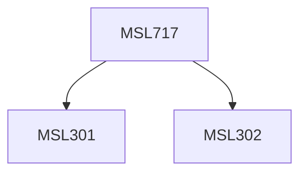

**Credits:** 3 (3-0-0)

**Prerequisites:** [[/Management Studies/MSL301|MSL301]] & [[/Management Studies/MSL302|MSL302]]

#### Description
This course will have the following topics: System Analysis Fundamentals: Introducing SA&D for Systems Professionals, Analyzing the Business Case and Managing Systems Projects, Overview to Data Structure in Systems Modeling, Data Flow Diagrams and Modelling DFDs, Requirements Modelling and Systems Specification, User Driven Business Analysis, Role of the consultant, Object Oriented Modelling: Object Relationships, Hierarchies, Use Case Approaches to identify and model classes, Process Driven Approaches: Gane, Sarson and Yourdon techniques, Data Driven Approaches: Entity Relationship Diagrams, Designing the User Interface and Output, Verification & Validation of new systems.

### Prerequisite Tree

