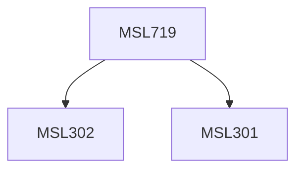

**Credits:** 3 (3-0-0)

**Prerequisites:** [[/Management Studies/MSL301|MSL301]] & [[/Management Studies/MSL302|MSL302]]

#### Description
Nature and role of statistics for management. Types of data, data measurement scales, Descriptive Statistics: Measures of Central Tendency, Measures of Dispersion. Introduction to probability theory. Probability Theory: Preliminary concepts in Probability, Basic Theorems and rules for dependent/independent events, Random Variable, Probability distributions. Sampling Techniques, Sampling distributions. Hypothesis testing: Z-test, t-test, ANOVA, Chi-square tests, Correlation and regression analysis. Business Forecasting. SPSS and its use for statistical modeling.

### Prerequisite Tree

