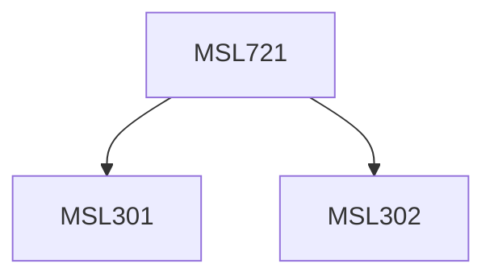

**Credits:** 3 (3-0-0)

**Prerequisites:** [[/Management Studies/MSL301|MSL301]] & [[/Management Studies/MSL302|MSL302]]

#### Description
Introduction to Econometrics, Simple linear regression model. Multiple linear regression model, Discrete Choice, Panel Data,Time Series, Stationarity, VAR, Co-integration and Error correction models.

### Prerequisite Tree

