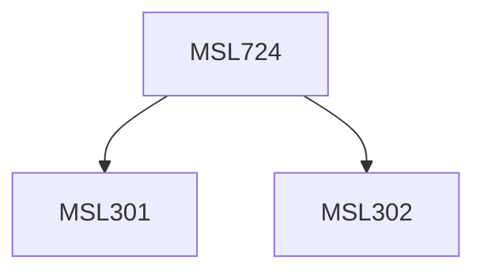

**Credits:** 1.5 (1.5-0-0)

**Prerequisites:** [[/Management Studies/MSL301|MSL301]] & [[/Management Studies/MSL302|MSL302]]

#### Description
On completion of this course, students would be able to: Evaluate the key purposes of communication in business. Explain the communication process model and the barriers to effective communication. Understand & evaluate the changing landscape of business communication. Apply techniques for effective communication.

### Prerequisite Tree

