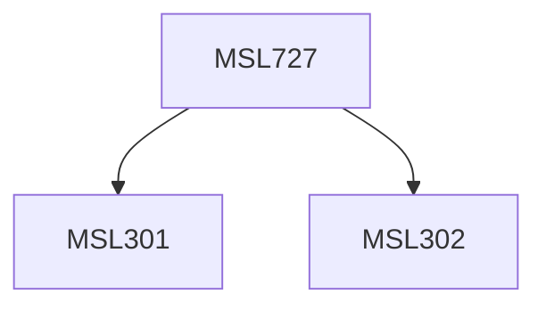

**Credits:** 1.5 (1.5-0-0)

**Prerequisites:** [[/Management Studies/MSL301|MSL301]] & [[/Management Studies/MSL302|MSL302]]

#### Description
On completion of this course, students would be able to: Understand the nature, structure and formation of teams. Appreciate the competitive and collaborative dynamics between teams and sub- teams. Understand and apply techniques for building and sustaining high performing teams. Reflect on their roles within teams and its impact on other members.

### Prerequisite Tree

