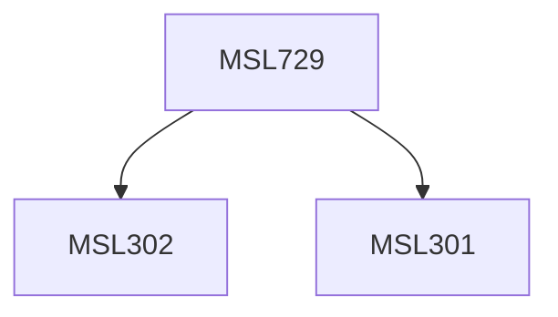

**Credits:** 1.5 (1.5-0-0)

**Prerequisites:** [[/Management Studies/MSL301|MSL301]] & [[/Management Studies/MSL302|MSL302]]

#### Description
This course will focus on understanding the nature, composition and relevance of organizational behaviour. Students will be introduced to the fundamental concepts and theories underpinning organizational behaviour. For every concept / theory introduced, its application for organizations would be discussed.

### Prerequisite Tree

