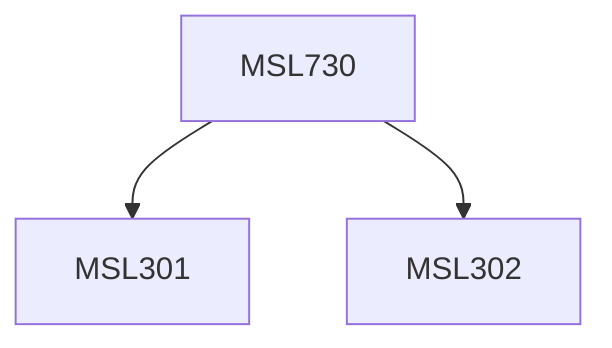

**Credits:** 1.5 (1.5-0-0)

**Prerequisites:** [[/Management Studies/MSL301|MSL301]] & [[/Management Studies/MSL302|MSL302]]

#### Description
This course covers power dynamics, the basic art of influencing, types of power, display of power at various levels and power vs empowerment and ethics. Various cases and readings are included for deeper understanding and application of the learnings.

### Prerequisite Tree

