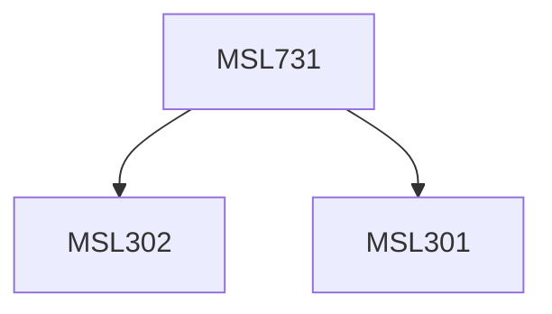

**Credits:** 1.5 (1.5-0-0)

**Prerequisites:** [[/Management Studies/MSL301|MSL301]] & [[/Management Studies/MSL302|MSL302]]

#### Description
Important areas of self awareness: Personal values, moral maturity, cognitive styles, attitude towards change, Locus of control, social needs of achievement, inclusion, control and affiliation.

### Prerequisite Tree

