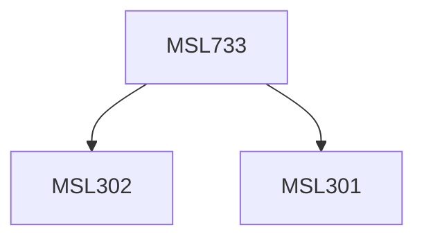

**Credits:** 1.5 (1.5-0-0)

**Prerequisites:** [[/Management Studies/MSL301|MSL301]] & [[/Management Studies/MSL302|MSL302]]

#### Description
Different issues related to the organization would be discussed and then applied in real life situations, the emphasis will be on application of theory to real life situations. The course would be imparted through a combination of lectures, cases and simulation exercises.

### Prerequisite Tree

