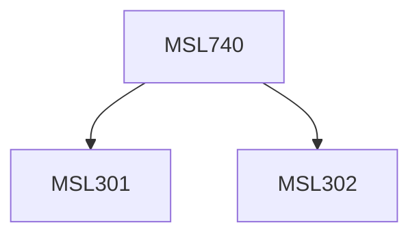

**Credits:** 3 (3-0-0)

**Prerequisites:** [[/Management Studies/MSL301|MSL301]] & [[/Management Studies/MSL302|MSL302]]

#### Description
Module I : Role of quantitative methods and operations research for managerial decision making and support. Role of mathematical models in problem formulation and solving. Structure of decisions, statistical decision theory; decision making under uncertainty, risk, certainty. Decision Trees; Fuzzy Decision Making. Game theoretic applications. Mathematical Programming models- formulation and applications. Linear Programming- graphical method, Simplex technique; transportation, assignment and transshipment problems. Mixed Integer Programming.

Module II : Non-Linear Programming, introduction to Quadratic Programming, Geometric Programming and Direct Search techniques. Multiple Criteria Decision making- Goal programming, TOPSIS and AHP.

Module III : Sequential decisions using Dynamic Programming. PERT and CPM. Queuing theory- M/M/1 and M/M/n model. Monte Carlo System Simulation concepts and applications. Brief introduction to Non-traditional optimization. Case Study applications and use of OR software packages.

### Prerequisite Tree

