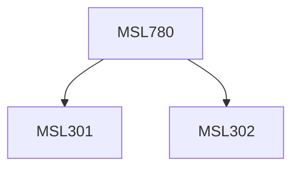

**Credits:** 1.5 (1.5-0-0)

**Prerequisites:** [[/Management Studies/MSL301|MSL301]] & [[/Management Studies/MSL302|MSL302]]

#### Description
Introduction to managerial economics. Basic concepts, Consumer behavior, Demand analysis: Determinants, estimation and managerial uses of elasticity of demand. Demand forecasting. Supply function and Market equilibrium analysis. Production and Cost analysis and Equilibrium of the firm, production Analysis, Productivity Analysis, Production efficiency analysis. Pricing and output under different market situations: Perfect Competition, Monopolistic Competition, Monopoly, Oligopoly and Cartels.

### Prerequisite Tree

