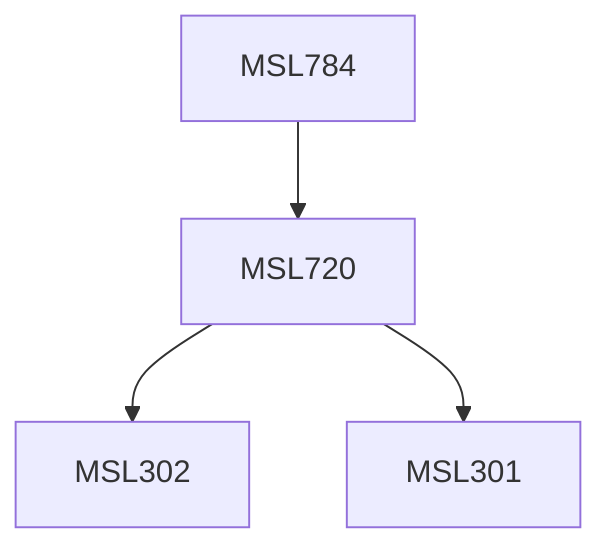

**Credits:** 3 (3-0-0)

**Prerequisites:** [[/Management Studies/MSL720|MSL720]]

#### Description
Origin of money, banks, and the central banking; Sovereign debt; The role of borrowing; External and foreign currency borrowing; Sovereign default: A historical perspective; Theoretical models of default (e.g., reputation); Laws and economics of sovereign default and restructuring; Sovereign debt and default- The International Experience.

### Prerequisite Tree

