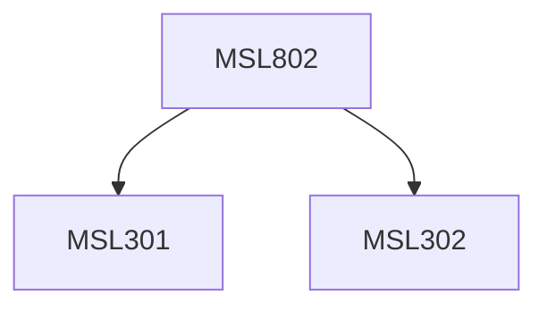

**Credits:** 3 (3-0-0)

**Prerequisites:** [[/Management Studies/MSL301|MSL301]] & [[/Management Studies/MSL302|MSL302]]

#### Description
Module I : Nature of Intellectual Property; Patents, Industrial Design, Trademark and Copyright; Process of patenting and development; technological research, innovation, patenting, development; International cooperation on Intellectual Property; International treaties on IPRs; Patenting under PCT. Procedure for grants of patents.

Module II : Scope of Patent Rights; Licensing and transfer of technology; Patent information and databases; Geographical Indications.

Module III : Administration of Patent System. New developments in IPR; IPR of biological systems,plant varieties, computer softwares etc. Traditional knowledge; Case Studies; IPR and IITs.

### Prerequisite Tree

