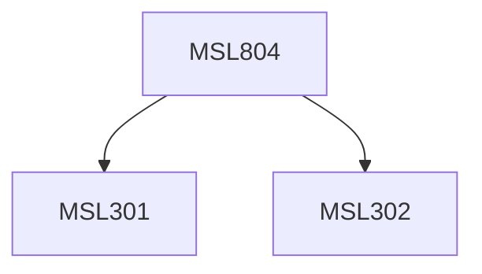

**Credits:** 3 (3-0-0)

**Prerequisites:** [[/Management Studies/MSL301|MSL301]] & [[/Management Studies/MSL302|MSL302]]

#### Description
This course will introduce students to purchasing and materials management by learning the planning production process, master scheduling, material requirements, and forecasting material demands and inventory levels. This course is designed to build on the student’s knowledge of how effective material management improves supply chain performance.

### Prerequisite Tree

