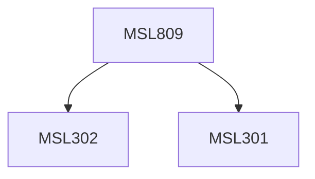

**Credits:** 3 (3-0-0)

**Prerequisites:** [[/Management Studies/MSL301|MSL301]] & [[/Management Studies/MSL302|MSL302]]

#### Description
This course introduces students to the interdisciplinary field of cybersecurity by discussing the following: cybersecurity theory, and the relationship of cybersecurity to nations, businesses, society, and people, cybersecurity technologies, processes, and procedures, analyzing threats, vulnerabilities and risks present in these environments, and develop appropriate strategies to mitigate potential cybersecurity problems, advanced policy related topics would also be covered through which these risks may be mitigated. Other relevant advanced topics may be explored.

### Prerequisite Tree

