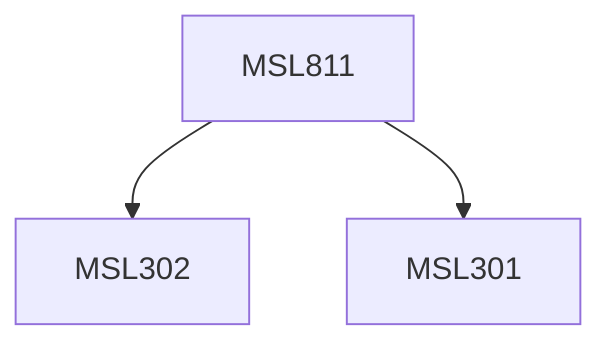

**Credits:** 3 (3-0-0)

**Prerequisites:** [[/Management Studies/MSL301|MSL301]] & [[/Management Studies/MSL302|MSL302]]

#### Description
Module I : Nature of Management Control Systems: planning and control process. Essentials of Management Control System. Behavioural aspects of Management Control-motivation and morale, goal congruency, and so on. Management Control Process: Programming, Budgetary Planning and Procedures, Fixed and Flexible Budgeting, Zero Base Budgeting. Internal Audit and Internal Control. Standard Cost Accounting Systems as measures of operating performance.

Module II : Variance Analysis and reporting of financial performance: Material, Labour and Overhead Cost Variances, Revenue Variances, Profit Variances, Variance Reporting.

Module III : Management Control Structure: Responsibility Accounting System- Concept of Responsibility Centre, Expense Centre, Profit Centre, Investment Centre. Inter-Divisional Transfer Pricing System, Measurement of Division Performance.

### Prerequisite Tree

