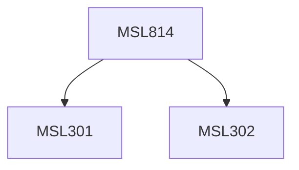

**Credits:** 1.5 (1.5-0-0)

**Prerequisites:** [[/Management Studies/MSL301|MSL301]] & [[/Management Studies/MSL302|MSL302]]

#### Description
This course would have the following: It would train the participants to use visual imagery to present complex information and the trends associated with extensive data. Visualization provides a solution to address information overload, through a well-designed visual encoding to aid comprehension, memory, and decision making. Furthermore, visual representations may help engage more diverse audiences in the process of analytic thinking. Topics like data and image models, heat maps, infographics, multidimensional data visualization and representation, graphical perceptions, mapping & cartography and text visualization may be covered. Other relevant topics within the subject domain may also be explored.

### Prerequisite Tree

