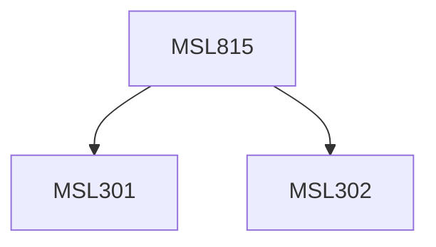

**Credits:** 3 (3-0-0)

**Prerequisites:** [[/Management Studies/MSL301|MSL301]] & [[/Management Studies/MSL302|MSL302]]

#### Description
Module I : The management support framework for computers. Fundamentals of decision theory and decision modelling. Humans and information processors and information systems as decision systems. Human decision styles.

Module II : Models, heuristics, and simulation. Overview of DSS- database, modelbase, user interface. DSS development methodology and tools. Need for expertise in decision models and expert systems. Expert systems fundamentals. Knowledge engineering, knowledge representation and inferencing. Building expert systems.

Module III : Integrating expert systems and DSSs. Strategies for implementing and maintaining management support systems. Case studies, and laboratory and filed projects.

### Prerequisite Tree

