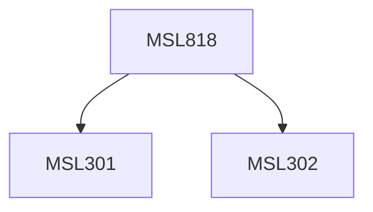

**Credits:** 3 (3-0-0)

**Prerequisites:** [[/Management Studies/MSL301|MSL301]] & [[/Management Studies/MSL302|MSL302]]

#### Description
Module I : The concept of industrial system. Systems waste and waste management. Wastivity and productivity measurement. The categories of industrial systems waste. Stages and causes of waste generation in industrial systems. Waste reduction measures and systems in industry. Collection and disposal system of scrap, surplus and obsolete items. Recycling and processing of industrial waste. Industrial pollution and environment control.

Module II : Value engineering, design waste and cost reduction. Inspection rejects and quality management. Reliability, maintenance, breakdown and management of waste. Space waste and layout planning. Time management, manpower waste in industry, absenteeism. Capacity utilization. Waste heat recovery and energy waste in industry. Resource conversation/loss prevention in process industries. Data and information waste, management of hazardous waste. Waste treatment. Natural calamities. Accident prevention, industrial safety and waste management.

Module III : Waste management in Indian industries- present practices, potentials and perspectives. Management of waste in different industrial systems- steel, aluminum, power, automobile, transport and other service industries. Economic analysis and system models of industrial waste management systems. Analytical and Creative techniques to waste control.

### Prerequisite Tree

