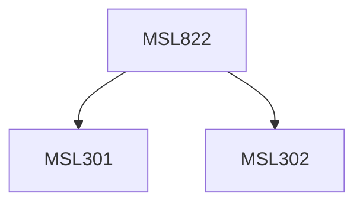

**Credits:** 3 (3-0-0)

**Prerequisites:** [[/Management Studies/MSL301|MSL301]] & [[/Management Studies/MSL302|MSL302]]

#### Description
Module I : Key Issues in International Business. Socio-cultural, economic and political forces facing business. International sourcing. Understanding the determinants of competitive advantage in international business at the national, industry and firm level. Global forces transforming international business. Multinational Corporation. Problems and Prospects in an International Environment, competitive and cooperative business strategy.

Module II : International Business Strategy of Indian Industry. Competitive position of key Indian Industries. Entry strategies for Indian firms: Joint Ventures, strategic/technical alliances/ collaboration. Strategies employed by Indian firms to develop and sustain international business.

Module III : Globalization Strategy. Globalisation strategy, strategies of Multinational Corporation, implications for functional strategies: marketing, HR, planning, organisational structure, production, Global Information Systems, Strategy Alternatives for Global Market entry and expansion, International negotiations.

### Prerequisite Tree

