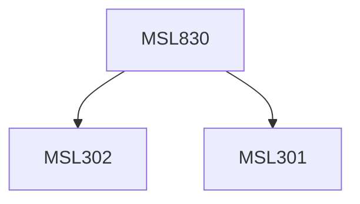

**Credits:** 3 (3-0-0)

**Prerequisites:** [[/Management Studies/MSL301|MSL301]] & [[/Management Studies/MSL302|MSL302]]

#### Description
Module I : Organisational structure- classical and neoclassical theories. Strategy and structure. Modern Organizational theory- systems view of organisation and integration. Micro, intermediate, macro environment. Participative structures.

Module II : Work culture and organization processes. Decision processes, balance and conflict processes. The process of role and status development. Influence processes and technological processes. Capacity development in organizations.

Module III : Interface of structure and processes- structural functionalism; Allport and Event- Structure theory. Organizational Governance- organizations as a subject of political enquiry, Models of organizational governance. Making and breaking patterns.

### Prerequisite Tree

