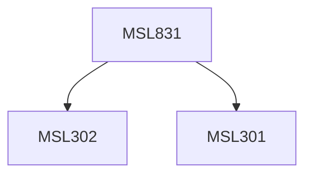

**Credits:** 3 (3-0-0)

**Prerequisites:** [[/Management Studies/MSL301|MSL301]] & [[/Management Studies/MSL302|MSL302]]

#### Description
Module I : Process of change and organization theory and practice. Elements of change. Achieving Systematic change. Domains of systematic change-strategy, technology, structure and people. Planning for change.

Module II : Change and the use of power. Nature and sources of power. Leadership and change- Transactional vs. Transformational change. Change cycle including participative and coerced change.

Module III : Change through behaviour modification. Positive and negative reinforcement. Training for change. Managing conflict. Implementing change. Adjustment to change and organising for growth. Prerequisites and consequence of change. The change Dynamics.

### Prerequisite Tree

