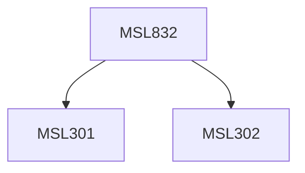

**Credits:** 3 (3-0-0)

**Prerequisites:** [[/Management Studies/MSL301|MSL301]] & [[/Management Studies/MSL302|MSL302]]

#### Description
Module I : Elements of creativity person, creative organization, nature of innovation. Assessing creativity. Tools and techniques for enhancing creativity. Innovation and risk.

Module II : Managing social equity and organisation efficiency paradox, blocks to creativity, methods to overcome the blocks. Introducing creativity in organisation. Structure and creativity. Work culture and innovation.

Module III : Practices of creativity and intervention strategies- organization excellence: Criteria and practice-innovation and quality, Innovation and BPR/appraisal system- interventions. Innovation and competitiveness.

### Prerequisite Tree

