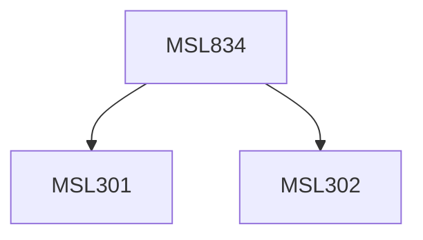

**Credits:** 1.5 (1.5-0-0)

**Prerequisites:** [[/Management Studies/MSL301|MSL301]] & [[/Management Studies/MSL302|MSL302]]

#### Description
The course introduces students to the relational framework towards diversity management by discussing the macro, meso and micro factors influencing DM. Through analysis of the different organizational approaches and initiatives towards diversity management, it highlights ways in which inclusive workplaces can be created and diversity leveraged for business performance.

### Prerequisite Tree

