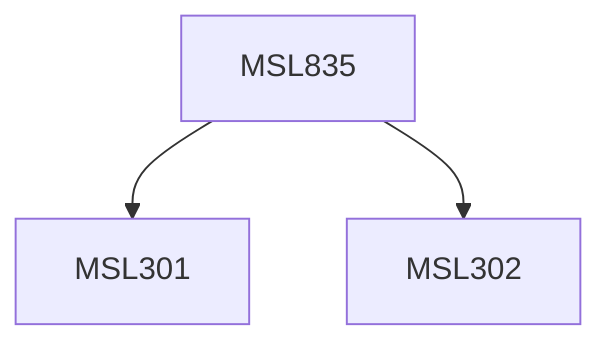

**Credits:** 3 (3-0-0)

**Prerequisites:** [[/Management Studies/MSL301|MSL301]] & [[/Management Studies/MSL302|MSL302]]

#### Description
Module I : Introduction of industrial relation and a systematic view of personnel. Labour Relations. Introduction to Indian Trade Unionism. Industrial relations and conflict in industries. Introduction of Labour Regulation Act, Factories Act, Trade Union Act, and Safety Act.

Module II : Role of Industrial Legislation. Introduction of Industrial Dispute Act. Different jurisdiction of Labour Court. Issues in recognition of unions. Tribunal and national tribunal. Strategies for resolving Industrial Conflict, Collective bargaining. Works committee and joint consultative committee, Negotiation process.

Module III : Influence of Government regulations. Third party intervention in industrial disputes. Rules of grievances. Discipline in Industry. Contribution of tripartite bodies. Labour Welfare Participative Management. Workman’s Compensation Act. Productivity in Industry. Healthy industrial relations and economic development.

### Prerequisite Tree

