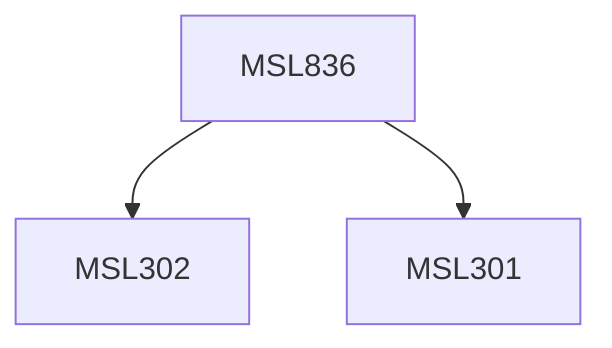

**Credits:** 1.5 (1.5-0-0)

**Prerequisites:** [[/Management Studies/MSL301|MSL301]] & [[/Management Studies/MSL302|MSL302]]

#### Description
The course would cover issues pertaining to selecting, managing and developing international workforce. It would sensitize students to the cross-cultural issues faced by global organizations and emerging issues within international HRM. Lectures, small group discussions and case study analysis would be the primary teaching methods adopted in this course.

### Prerequisite Tree

