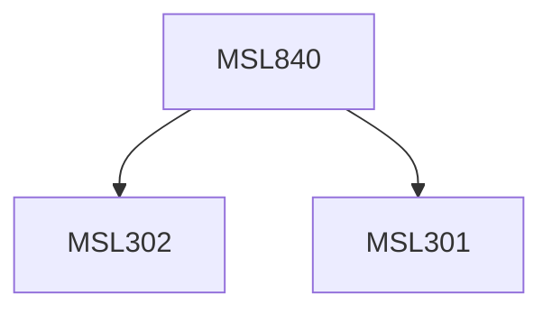

**Credits:** 3 (3-0-0)

**Prerequisites:** [[/Management Studies/MSL301|MSL301]] & [[/Management Studies/MSL302|MSL302]]

#### Description
Module I : Manufacturing and operations strategy-relevance and concepts. Strategic issues in manufacturing & operations, Capacity planning, International innovations in manufacturing. Choice of technology and manufacturing process in the prevailing environment.

Module II : Technology-manufacturing process interfaces with marketing, engineering, quality, purchasing, finance and accounting. Inter-relationship among manufacturing manager and their suppliers, customers, competitors, superiors and production workers.

Module III : Strategic implications of Experience Curve. Focused manufacturing-green, lean and mean. Strategic issues in project management and implementation of manufacturing policies. Perspectives of Manufacturing Strategy. Case Studies.

### Prerequisite Tree

