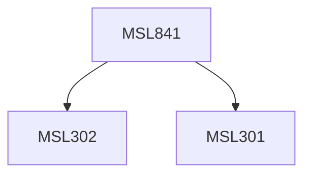

**Credits:** 3 (3-0-0)

**Prerequisites:** [[/Management Studies/MSL301|MSL301]] & [[/Management Studies/MSL302|MSL302]]

#### Description
This course will introduce students to supply chain analytics by learning the three aspects of supply chain planning and design. The first one is Descriptive Analytics of supply chain, which focuses on fundamental tools and methods on data analysis and statistics, visual representations of data and data modeling. The second major focus is on Predictive Analytics of supply chain, which develops approaches for building and analyzing predictive models, applying regression, forecasting techniques, simulation and risk analysis, etc. The third major focus is on Prescriptive Analytics of supply chain, which aims at arriving at optimal decisions for the different future scenarios in the supply chain.

### Prerequisite Tree

