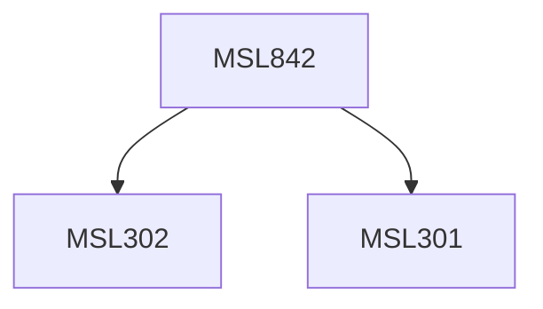

**Credits:** 3 (3-0-0)

**Prerequisites:** [[/Management Studies/MSL301|MSL301]] & [[/Management Studies/MSL302|MSL302]]

#### Description
This course primarily deals with understanding and analyzing problems underlying the design, planning and operation of supply chains, with a special emphasis on the logistical and other issues related to the material and the information flow in these systems. The main objective of the course is to introduce methodological description of the various issues in supply chain related to design, planning and control problems. Mathematical models and techniques are used to support the analysis of the identified issues. It also develops understanding of some basic tools that can support the functioning of the analytical methodologies.

### Prerequisite Tree

