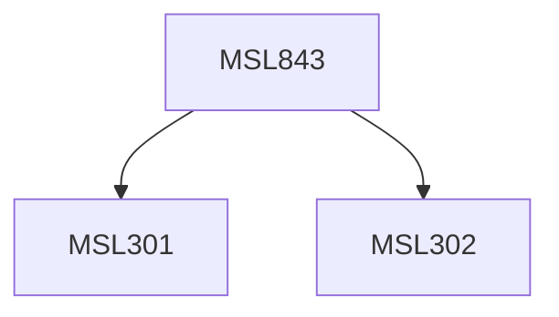

**Credits:** 3 (3-0-0)

**Prerequisites:** [[/Management Studies/MSL301|MSL301]] & [[/Management Studies/MSL302|MSL302]]

#### Description
Module I : Perspective of Supply Chain Logistics Management. Logistics concept, role and scope; Logistics Environment- Integrating Logistics of Supply, Logistics of Production and Logistics of Distribution. Internal and external factors for logistics strategy, Operational Resources of logistics (personnel, warehouse means of transport, warehouse transport aids, organizational aids, material stocks, and area/spare) Effective supply chain management, customer networking and manufacturing, Risk Pooling, Postponement, cross docking in supply chain, CPFR, IT-enabled supply chains value of Information, Coordination in SCM.

Module II : Logistics Activity Mix. JIT and Logistics, Synchronised manufacturing. Purchasing and Materials Management. Distributional logistical systems and facilities-single stage or multistage, warehouse(s), their number, location and allocation, Automated Warehousing, Materials Handling and Packaging. Simulation aided planning of conveyor and warehousing systems.

Module III : Supply Chain Logistics Mix Management. Logistical Connectivity: Transportation modes, rate structure, legal aspects;

maintenance, spares and repairs; test and support equipment, Routing of freight flows. Management and Organization of the Logistics Systems; Organization, Information and cost control; Logistical information Systems, Computer aided logistics management. Case Studies.

### Prerequisite Tree

