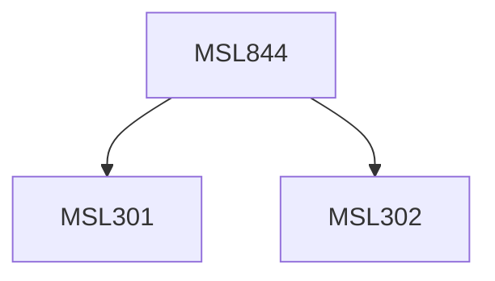

**Credits:** 3 (3-0-0)

**Prerequisites:** [[/Management Studies/MSL301|MSL301]] & [[/Management Studies/MSL302|MSL302]]

#### Description
Module I : Reliability, Safety, Risk Assessment Perspective. Introduction to reliability, availability and safety engineering and management. Select statistical concepts and probability distributions. Optimization techniques for systems reliability, availability and safety. Reliability, availability, safety and maintainability. Risk assessment and management for reliability and safety.

Module II : Maintenance Planning and Control.

Maintenance management objectives and functions. Classification of Maintenance system. Maintenance Planning and Scheduling. Issues of Replacement versus reconditioning and imperfect repair maintenance models. Spare parts Inventory Planning and Control for single and multi-echelon systems. Diagnostic tools of failure analysis: Failure Mode Effect and Criticality Analysis, Fault Tree Analysis.

Module III : Information System for Reliability, Safety and Maintenance Management.

Organizational aspects and a computer aided management information system for reliability, safety and maintenance. Life cycle costing and cost management for maintenance. Human factors in maintenance, Maintenance Manpower Planning. Case Studies.

### Prerequisite Tree

