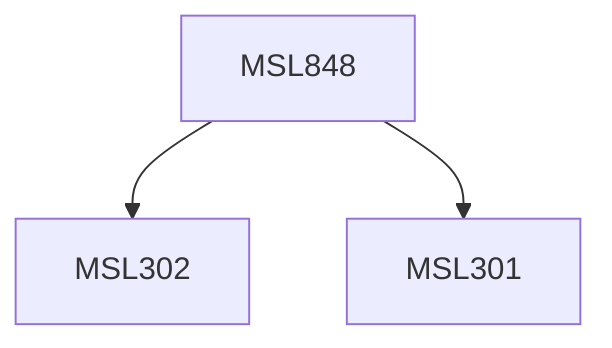

**Credits:** 3 (3-0-0)

**Prerequisites:** [[/Management Studies/MSL301|MSL301]] & [[/Management Studies/MSL302|MSL302]]

#### Description
The objective of the course is to provide the students about the application of Operations Research (OR) in various functional areas of business such as operation, supply chain management, materials management, marketing, finance, and human resource. The entire course is a case based where the participants will be given a case. Participants will be asked to tackle the case problem without using OR using their own experience or any other logical method and then they will be asked to tackle the same situation applying OR. At the end of the course they will appreciate how OR can help the decision makers in an efficient decision making process.

### Prerequisite Tree

