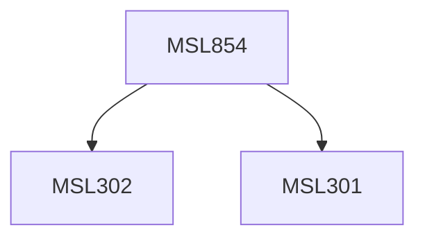

**Credits:** 1.5 (1.5-0-0)

**Prerequisites:** [[/Management Studies/MSL301|MSL301]] & [[/Management Studies/MSL302|MSL302]]

#### Description
This course may expose the student to the following themes within the discipline: Introduction to Data Science and Data Scientists, Introduction to Big Data, Theories in Data Science, Big data technologies, Large query data sets and associated theories, Exploring the Hadoop Ecosystem, Information management in Big Data and Emerging Issues.

### Prerequisite Tree

