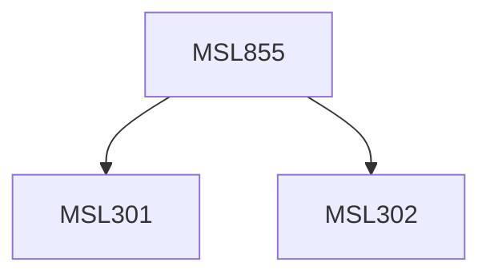

**Credits:** 3 (3-0-0)

**Prerequisites:** [[/Management Studies/MSL301|MSL301]] & [[/Management Studies/MSL302|MSL302]]

#### Description
This course may expose the participants to the following topics: Introduction to e-commerce, B2B E-commerce models, B2C E-Commerce models, Mercantile processes, E-Commerce Infrastructure and Capacity Planning, Web Portals & Services, Trading, Pricing, Auctions, Bartering & Negotiations, Advanced and emergent topics in E-Commerce, Inter-organization information systems, e-procurement systems, e-fulfillment systems, e-SCM, Risk management in E-commerce. Hands on training may also be provided.

### Prerequisite Tree

