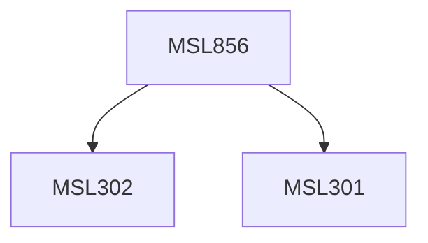

**Credits:** 3 (3-0-0)

**Prerequisites:** [[/Management Studies/MSL301|MSL301]] & [[/Management Studies/MSL302|MSL302]]

#### Description
The course will consist of the following: Introduction to data mining, types of data mining systems, data preprocessing and data warehouses (OLAP/OLTP), Data Cube Computation and Data Generalization, Mining Frequent Patterns, Associations, Correlations, Classification, Prediction, Clustering, time series and sequence data analysis, Graph Mining, Social Network Analysis, and Multirelational Data Mining, Mining Object, Spatial, Multimedia, Text, and Web Data, Applications and trends.

### Prerequisite Tree

