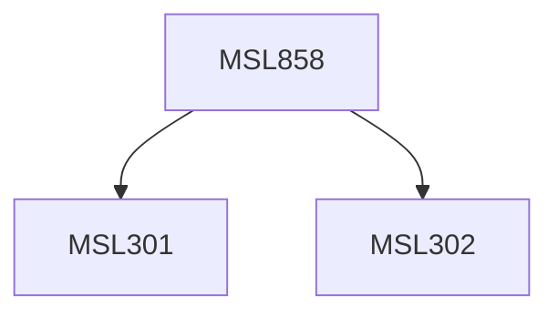

**Credits:** 1.5 (1.5-0-0)

**Prerequisites:** [[/Management Studies/MSL301|MSL301]] & [[/Management Studies/MSL302|MSL302]]

#### Description
This course may expose the participants to the following topics: Concepts of process and business process, Processes and workflow management systems, Concepts and evolution of BPM technologies, Impact of IT in BPM and its road map, BPM Cycle, Process deployment, Process monitoring, Process optimization using IT tools, Flowcharting and business process mapping and emergent issues in BPM/BPR technologies. Other relevant topics within the subject domain may also be explored.

### Prerequisite Tree

