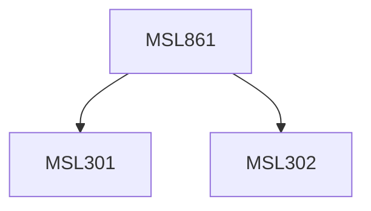

**Credits:** 3 (3-0-0)

**Prerequisites:** [[/Management Studies/MSL301|MSL301]] & [[/Management Studies/MSL302|MSL302]]

#### Description
Module I: Research concepts; exploratory, descriptive and conclusive research. The market decision-making process and the need of different types of research. Types of marketing problems and type of marketing research activity. Sources of data; use and appraisal of existing information.

Module II: Information from respondents, sampling design, scaling techniques and questionnaire design, interviewing, mail surveys. Information from experiment, experimental design for marketing, Motivational research, Advertising research, Analysis and reporting.

Module III: Marketing information systems, Structure and design, its role in planning and control; the place of marketing research.

### Prerequisite Tree

