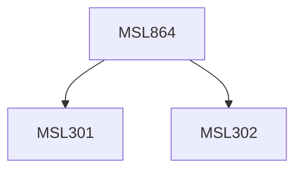

**Credits:** 3 (3-0-0)

**Prerequisites:** [[/Management Studies/MSL301|MSL301]] & [[/Management Studies/MSL302|MSL302]]

#### Description
Corporate communications is a strategic tool that is leveraged to gain strategic advantage. Organizations use it to lead, motivate, persuade and inform both employees and outside stakeholders. How organizations set objectives, define messages and reach their employees, extended audiences, the media and customers, and how the company or group articulates its vision and brings its values to life, will all be discussed.

The course will familiarize students with some of the issues that specifically affect organisations and challenge the corporate communications function. Some of these issues include a change in CEO, mergers and acquisitions, imposition of government regulation and public pressure groups. Focus will be placed on crafting corporate messages for internal and external stakeholders. Specific subject.

### Prerequisite Tree

