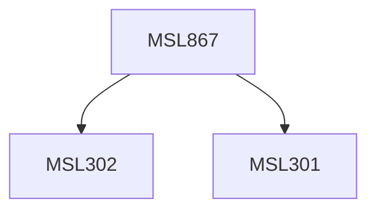

**Credits:** 3 (3-0-0)

**Prerequisites:** [[/Management Studies/MSL301|MSL301]] & [[/Management Studies/MSL302|MSL302]]

#### Description
Module I: Industrial marketing and Environment. Application of industrial buyer behaviour theories. Marketing plan to implement the marketing concept.

Module II: The new product development process. Personal selling (negotiations, systems selling, targets setting, fact finding, training); sales communications.

Module III: Marketing Research for industrial product Marketing control (variance analysis audit). Industrial purchase behaviour and processes, new product launch. Forecasting methods.

### Prerequisite Tree

