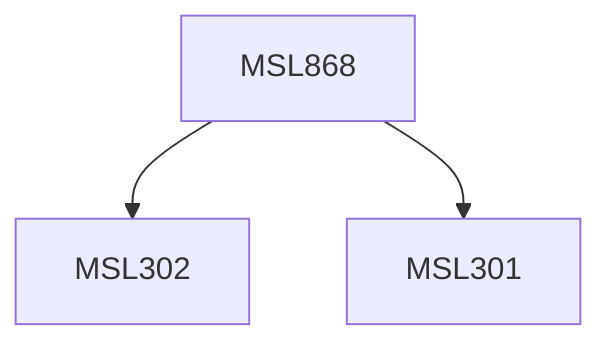

**Credits:** 1.5 (1.5-0-0)

**Prerequisites:** [[/Management Studies/MSL301|MSL301]] & [[/Management Studies/MSL302|MSL302]]

#### Description
The course will have the following coverage: Internet as a research medium; Research design; Sampling methods; Online surveys; Nonreactive data collection; virtual ethnography; Online focus groups; secondary qualitative data analysis; blogs & videos as source of data; data analysis approaches; tools.

### Prerequisite Tree

