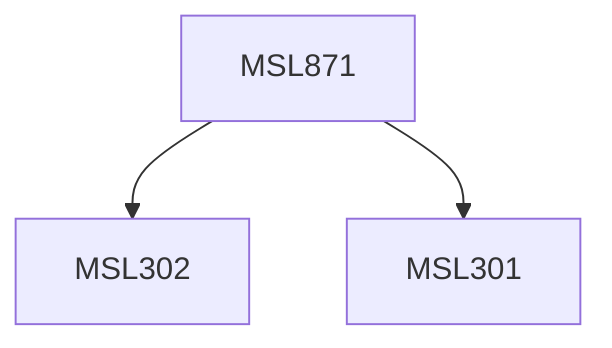

**Credits:** 1.5 (1.5-0-0)

**Prerequisites:** [[/Management Studies/MSL301|MSL301]] & [[/Management Studies/MSL302|MSL302]]

#### Description
The course will comprise of two broad sections; banking and financial services. Banking portion will cover banking sector reforms, bank management, financial statements of banks, sources and uses of bank funds, Credit monitoring and management by banks, bank capital and Basel norms. Financial services will encompass both fund based and fee based services that are an integral part of modern financial systems; it will include lease financing, hire purchase financing, consumer Credit, factoring, housing finance, investment banking, Credit rating, stock broking, depository and custodial services. The course work will encompass problem solving on relevant topics and inputs from real life cases to give a practical insight to the theoretical concepts.

### Prerequisite Tree

