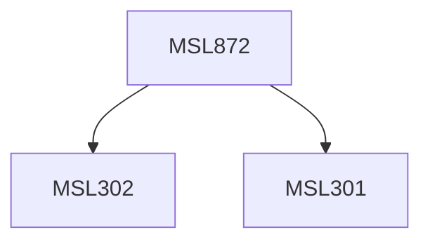

**Credits:** 3 (3-0-0)

**Prerequisites:** [[/Management Studies/MSL301|MSL301]] & [[/Management Studies/MSL302|MSL302]]

#### Description
Module I: Nature and Financial of Working Capital. Nature of Working Capita, Trade-off between Profitability and Risk, Determinants of Working Capital. Factoring as a Sources Finance. Forecasting Working Capital requirements. Sources of financing Working Capital. Factoring as a source of finance. Bank Credit and working capital Finance. Approaches to determine Financing Mix. Working Capital Leverage. Cases and Practical Problems.

Module II: Current Assets Management. Cash Management, Inventory Management, Receivables Management. Cases and Practical Problems.

Module III: Analysis aTools and New Development. Operating Cycle, Ratio Analysis, Funds-flow Analysis and Cash-Flow Statement as tools of Working Capital Management. Recent changes and new developments. Practical Problems.

### Prerequisite Tree

