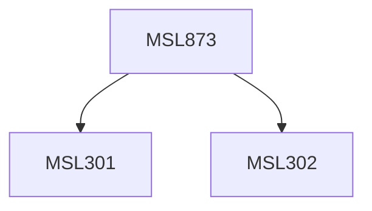

**Credits:** 3 (3-0-0)

**Prerequisites:** [[/Management Studies/MSL301|MSL301]] & [[/Management Studies/MSL302|MSL302]]

#### Description
Module I: Investment Environment. Saving and Financial flows, Financial Intermediation, Investment in Corporate Securities and other Investment Outlets, New Issue market and Secondary Markets. Sources of investment information. Theoretical framework for investment Decision. Regulatory Framework of Securities Markets in India.

Module II: Valuation of Securities. Valuation of Variable Income Securities (Equity Shares): Theory of Valuation-Earnings and Dividend Model. Fundamental Analysis, Aggregate Economic Analysis, Industry Analysis, Company Analysis, Technical Analysis, Growth Shares, Under and Overvalued Shares. Analysis of Fixed Income Securities like Preference Shares, Debentures/Bonds and other Financial Instruments. Interest Rate structure and yield to Maturity Curve. Convertible Bonds: Warrants and Options.

Module III: Portfolio Management. General principles. Measures of Risk and Return, Required Rate of Return and CAPM, Markkowitz Portfolio Theory. Efficient Capital Market Theory. Alternative Efficient Market Hypotheses. Constructing the Optimum Portfolio.

### Prerequisite Tree

