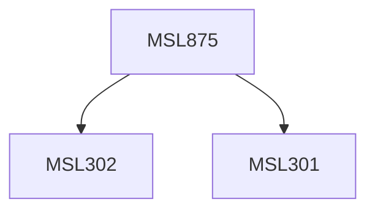

**Credits:** 3 (3-0-0)

**Prerequisites:** [[/Management Studies/MSL301|MSL301]] & [[/Management Studies/MSL302|MSL302]]

#### Description
Module I: Foreign Exchange Market and Risk Management : Environment of International Financial Management: Balance of Payments. Means of International Payments, Foreign Exchange Market, Currency Futures and Options Markets, Foreign Exchange Risk Management, Political Risk, Interest Rate Risk.

Module II: Financing of International Operations : Determination of Exchange Rate, Exchange Market and Arbitrage, Exchange Rate Control, Financing of Exports and International Investments, International Monetary Systems, European Monetary System, International monetary and Financial Institutions.

Module III: Financial Management of MNCs : Capital Budgeting Decisions for Multinational Corporation, Financing Decisions- Cost of Capital and Financial Structure, Working Capital Management and Control, International Banking, International Transfer Pricing.

### Prerequisite Tree

