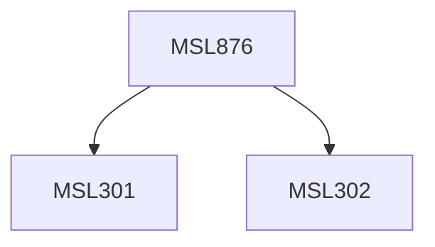

**Credits:** 1.5 (1.5-0-0)

**Prerequisites:** [[/Management Studies/MSL301|MSL301]] & [[/Management Studies/MSL302|MSL302]]

#### Description
This course may expose the participants to the following topics: Impact of diffusion of ICTs in Business and People,Trade-offs & Network effects, Economics of Data communication including pricing, Firms, Networks, Centralization, Decentralization in 2 sided markets, Factors affecting organizational structure and size, Dynamics of Open Source and Open Innovation, Information, Search, Switching and Price dispersion, Information goods pricing and bundling. Other similar themes may also be explored.

### Prerequisite Tree

