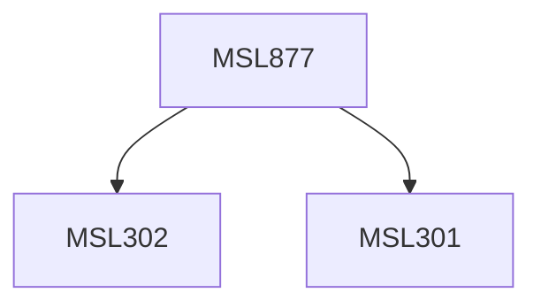

**Credits:** 1.5 (1.5-0-0)

**Prerequisites:** [[/Management Studies/MSL301|MSL301]] & [[/Management Studies/MSL302|MSL302]]

#### Description
This course may expose the participants to the following topics: Introduction to E-Governance, E-Governance models and frameworks, E-Governance infrastructure and stages in evolution, Information Management in Electronic Governance. Issues in Emerging and Developing Economies, Selective Case Studies in E-Governance, Emerging initiatives in electronic governance, Role of policy. Other relevant topics within the subject domain may also be explored.

### Prerequisite Tree

