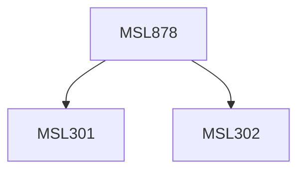

**Credits:** 1.5 (1.5-0-0)

**Prerequisites:** [[/Management Studies/MSL301|MSL301]] & [[/Management Studies/MSL302|MSL302]]

#### Description
This course may expose the participants to the following topics: Different business models in electronic payments, Digital certificates and certificate chains, Automated clearing and settlement systems, Banking systems and foreign exchanges, Other players in the ecosystem, E-Payment and Card security, Micro-payments, P2P Payments, Electronic Cash, Challenges and role of policy. Other relevant topics within the subject domain may also be explored.

### Prerequisite Tree

