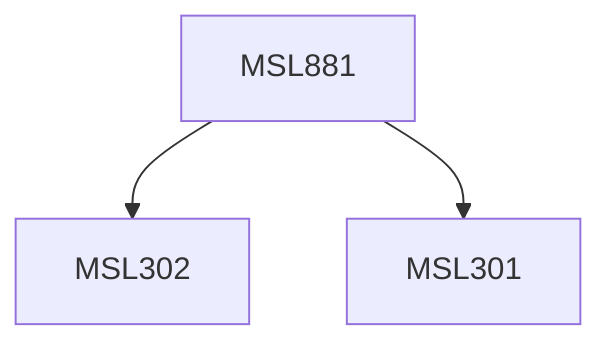

**Credits:** 3 (3-0-0)

**Prerequisites:** [[/Management Studies/MSL301|MSL301]] & [[/Management Studies/MSL302|MSL302]]

#### Description
This course will expose the participants to the following topics: Concepts of cloud computing and its impact, Technology Road Map to Cloud Computing, Virtualization, Practical usage of virtualization, Cloud Computing Frameworks and Deployment models. Cloud resource utilization and optimization, Cloud and Web Services, Service Model Architectures, SLA and QoS, Service Oriented Architecture and Cloud Computing.

### Prerequisite Tree

