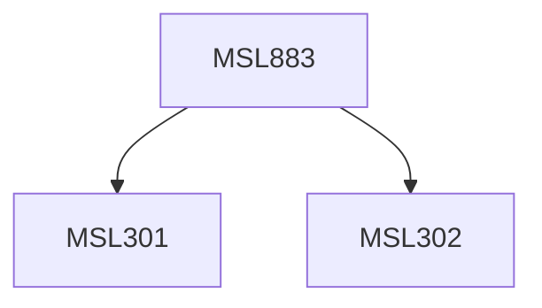

**Credits:** 3 (3-0-0)

**Prerequisites:** [[/Management Studies/MSL301|MSL301]] & [[/Management Studies/MSL302|MSL302]]

#### Description
The course will cover the following topics: Introduction, Development agendas and place of ICTs, ICTs as appropriate technologies, ICTs in education, health, industry & enterprises; ICT policy & regulations. Politics of open technology standards; ICT consulting for government; ICTs, Bottom of Pyramid & Business.

### Prerequisite Tree

