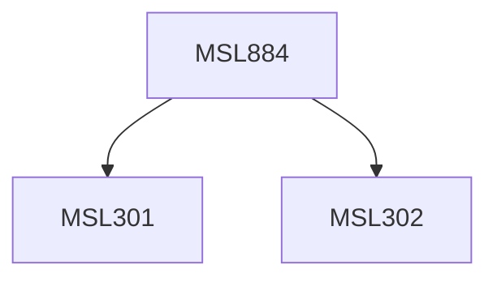

**Credits:** 3 (3-0-0)

**Prerequisites:** [[/Management Studies/MSL301|MSL301]] & [[/Management Studies/MSL302|MSL302]]

#### Description
This course may expose the participants to the following topics: IT Evolution and its implications for business, IT Productivity Paradox - Issues and Implications, Impact of IS in the Networked Economy, Reasons for success and failure of IT projects, Disaster planning, Approaches to IS Development (e.g. Portfolio approaches), Technology Justification and Alignment Models, Strategic impact of IT / IS, Role of the CIO and challenges in business continuity.

### Prerequisite Tree

